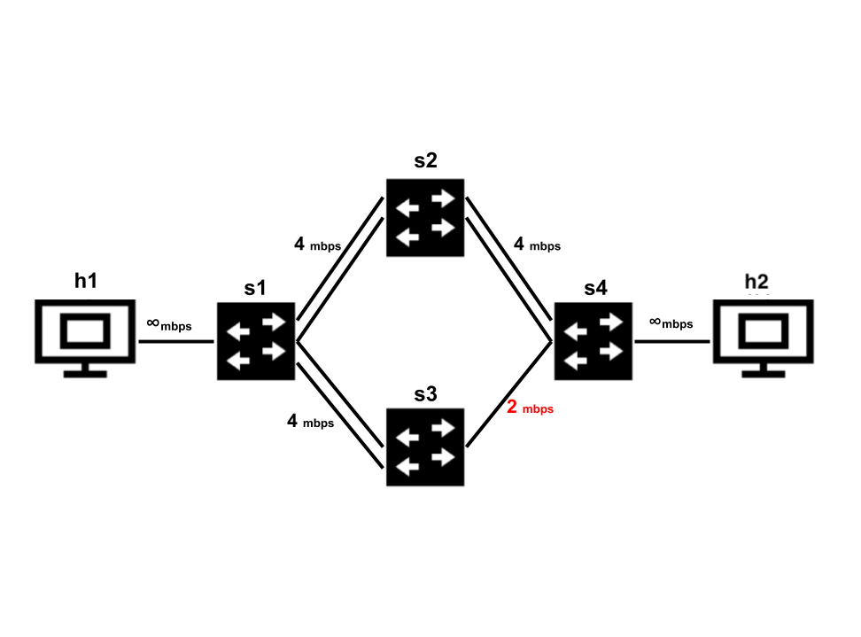

# Project 5: Flowlet Load Balancing

## Objectives

- Understand the concept of flowlets and detect flowlets in real-traffic
- Understand the benefits of flowlet based load balancing
- Understand the benefits of congestion aware load balancing

## Getting Started

To start this project, you will first need to get the [infrastructure setup](https://github.com/minlanyu/cs145-site/blob/spring2025/infra.md) and clone this repository with submodules
```
git clone --recurse-submodules <your repository>
```

When there are updates to the starter code, TFs will open pull requests in your repository. You should merge the pull request and pull the changes back to local. You might need to resolve conflicts manually (either when merging PR in remote or pulling back to local). However, most of the times there shouldn't be too much conflict as long as you do not make changes to test scripts, infrastructures, etc. Reach out to TF if it is hard to merge.

- In Project 5, we provide you with a skeleton P4 source file (`p4src/flowlet_switching.p4`), a completed topology file (`topology/p4app_fat_flowlet.json`) that implements a k=4 fat tree topology, and a completed controller script (`controller/controller_flowlet_fattree.py`) corresponding to the k=4 fat tree topology. You are expected to build your flowlet implementation on top of these files. However, it will also work if you choose to inherit your `p4src/l3fwd.p4`, `topology/p4app_fat.json` (Fattree with k=4), and `controller/controller_fat_l3.py` files from Project 3.
- We encourage you to revisit `p4_explanation.md` in project 3 for references if you incur P4 related questions in this project.

## Introduction

We implemented ECMP in Project 3. But one drawback of ECMP is that ECMP may hash two large flows onto the same path, which causes congestion. The purpose of this project is to divide large flows into smaller *flowlets* and run load balancing based on those flowlets (instead of flows). Flowlet switching leverages the burstness of TCP flows to achieve better load balancing. TCP flows tend to come in bursts (because TCP is window based). Every time there is gap which is big enough (e.g., 50ms) between packets from the same flow, flowlet switching will rehash the flow to another path (by hashing a flowlet ID value together with the 5-tuple). For more information about flowlet switching check out this [paper](https://www.usenix.org/system/files/conference/nsdi17/nsdi17-vanini.pdf).


## Part 0: Observing the problem

In this part, we use a `Medium topology` as illustrated in the following figure:

The bandwidth of each link is 2 Mbps.

We send flows from h1 to h5, from h2 to h6, from h3 to h7, and from h4 to h8. Each flow has four different potential paths to travel on. Let's first use the provided code and observe how flows collide.

1. Start the medium size topology:

   ```bash
   sudo p4run --config topology/p4app_medium.json
   ```

2. In a new terminal window, open a `tmux` terminal by typing `tmux` (or if you are already using `tmux`, open another window and type `tmux`) and run monitoring script (`nload_tmux_medium.sh`). This script uses `tmux` to create a window with 4 panes. In each pane it launches a `nload` session with a different interface (`s2-eth1`, `s3-eth1`, `s4-eth1`, and `s5-eth1`). These interfaces connect the switches `s2`, `s3`, `s4`, and `s5` to the switch `s1`. `nload` is a console application which monitors network traffic and bandwidth usage in real time. You can run `sudo apt install nload` to first ensure that `nload` has been installed in our provided VM. Then you can start monitoring in a new terminal window:

   ```bash
   tmux
   ./nload_tmux_medium.sh
   ```

3. Now let's send traffic from `h1-h4` to `h5-h8`. To do so, in another terminal window, run the following command.

   ```bash
   sudo apps/send_traffic.py --trace ./apps/trace/project5_onetoone.trace --protocol udp
   ```

   If each flow gets placed to a different path (very unlikely) you should get the average bandwidth close to `2Mbps` (which is the link bandwidth). In the example below, after trying once, we got 2 flows colliding on the same path (via s2), and the other two flows going via s3 and s5 thereby leaving the path via s4 underutilized:

<p align="center">

<p/>

You may send the traffic a few times to see how ECMP hashing can result in different load balancing each time. 

One way of solving this problem is to provide fine-grained load balancing to avoid hotspot congestion.

## Part 1: Flowlet Switching

In this part, you are expected to implement flowlet switching. 
You need to modify `p4src/flowlet_switching.p4` to implement flowlet switching. 

> [!NOTE]
> The P4 source code only describes the data plane implementation of an *individual* switch and is typically independent of the network topology.

The original ECMP hashes on 5 tuples of a flow to select paths. Now with flowlets, we hash on not only the 5 tuples of a flow but also its flowlet IDs so we can select different paths for flowlets of the same flow. Here is the concrete workflow:

1. We identify flowlets by maintaining the timestamp of the last seen packet of each 5-tuple flow. You can use `standard_metadata.ingress_global_timestamp` to get the current timestamp (in micro-second) in the P4 switch. You can maintain these timestamps for each flow in a hash table. You may consider setting a large hash table size, e.g, 8192, so that you do not need to handle hash collision.
2. We define the flowlet timeout as how long a flowlet remains active. If the next packet takes more than the flowlet timeout time to arrive, we treat it as the start of a new flowlet. We suggest you set flowlet timeout as **50ms** in your experiments. Whenever the difference between the current timestamp and the last timestamp is larger than the gap, then you should treat the packet as the starting packet of a new flowlet.
3. For each new flowlet, assign it with a random flowlet ID. A large flow can have many flowlets sometimes even over a thousand. Register width of 16 bits should be sufficient for storing a flowlet ID. Anything larger also should not be an issue. You can use `random(val, (bit<32>)0, (bit<32>)65000)` to get a random number from 0 to 65000, and the value is written to `val`.
4. Use a hash function to compute hash value for a combination of five tuples and the flowlet ID. Then use the hash value to select the port (and thus the path) the switch forwards this packet to. Due to modulo, this new hash value might be the same as the old one; but overall, flowlets are distributed among all paths evenly.
5. Consider whether or not to modify the controller code.

> [!TIP]
> Before you jump into implementing flowlet switching, take a moment to see the provided controller code `controller/controller_flowlet_fattree.py` to better understand the functionality of the P4 tables provided in the P4 code skeleton (`p4src/flowlet_switching.p4`).

## Hints
This code snippet provides an example of how to use registers in P4. We read from a register, compare its value with the packet's ingress global timestamp, and write the timestamp back to the register. Note that this example logic is different than what is required above.

```C
control MyIngress(inout headers hdr, inout metadata meta,
                  inout standard_metadata_t standard_metadata) {
    
    /* Declare a 48-bit wide register with a size of 8192 */
    register<bit<48>>(8192) my_register;

    apply {
        if (hdr.ipv4.isValid()){
            
            /* Declare temporary metadata variables to operate on the register */
            bit<48> reg_data;
            bit<16> reg_idx = 0; // we want to read/write at index 0 of my_register

            /* Read the content of the register with the index specified in reg_idx to reg_data */
            my_register.read(dst_data, (bit<32>) reg_idx); // note the bit<32> cast
            
            /* If the stored data in the register has a smaller value compared to the global timestamp */
            if (standard_metadata.ingress_global_timestamp > reg_data) {
               /* Update the register with the global timestamp value */
               my_register.write((bit<32>)reg_idx, standard_metadata.ingress_global_timestamp);
               // NOTE: register read/write operations need the reg_idx to be of bit<32> type
            }
        }
    }
}
```

### Testing
Your code should work for the following testing in a k=4 fat tree topology. These are also good steps for debugging.
1. Run your `p4src/flowlet_switching.p4` in a k=4 fat tree topology
```
sudo p4run --conf topology/p4app_fat_flowlet.json
```
2. Start your controller
```
./controller/controller_flowlet_fattree.py
```
3. **Testing connectivity:**
- Run `pingall`.
4. **Testing standard ECMP:** Note that in the absence of any flowlet gaps, flowlet switching essentially turns into ECMP. The first testing script runs multiple short flows (duration ~100ms) in the network. If your setup effectively balances the traffic from different flows onto different paths, as intended with original ECMP, then you should pass this test:
- Run `sudo python3 tests/validate_ecmp.py`. 
5. **Flowlet-based ECMP:** The second testing script tests Flowlet-based ECMP. Each test case involves only one long flow at a time that runs across pods i.e. the flow end-points are in different pods of the fat tree topology. If your implementation of Flowlet ECMP is accurate, you should be able to pass this test:
- Run `sudo python3 tests/validate_flowlet.py`. 


## Part 2: Compare Performance

In this part, let's compare the ECMP performance with flowlet switching (Your solution in Part One) and without flowlets (Project 3 solution) when network hotspots are encountered. 

1. Run ECMP without flowlet switching. Exit any running Mininet instances and switch to your project 3 directory to run the following steps:
    1. Run your `p4src/l3fwd.p4` which implements standard ECMP
    ```
    sudo p4run --conf topology/p4app_fattree.json
    ```
    2. Start your controller 
    ```
    ./controller/controller_fattree_l3.py
    ```   
    3. Send two iPerf flows with our provided script. (Flow 1: from h1 to h13, and Flow 2: from h3 to h16).
    ```
    sudo python3 apps/project5_send_traffic.py [duration_in_seconds] [random_seed] 
    ```
    The `random_seed` is used to generate random source and destination ports for the two flows. Since the ECMP hashing depends on the ports, you can tune the `random_seed` to make sure the two flows collide and thus generate network hotspot on the collided link. For tuning the `random_seed` just try a few different integers (e.g. 0, 1, 5, etc.) until the two flows collide. A duration of 10 seconds is typically sufficient. 
    
    4. You can check the iperf throughput values in the `log` directory to verify if the chosen paths have collided. A flow's average throughput is reported by the iperf server. Therefore, check the last line in both the server log files. For example:
    ```
    p4@p4:~/workspace/cs145-25-project3-user$ cat log/iperf_server_0.log
      -----------------------------------------------------------
      Server listening on 9829
      -----------------------------------------------------------
      Accepted connection from 10.0.0.1, port 34333
      [  8] local 10.0.0.13 port 9829 connected to 10.0.0.1 port 38327
      [ ID] Interval           Transfer     Bitrate
      [  8]   0.00-1.00   sec  56.3 KBytes   461 Kbits/sec
      <omitted output>
      [  8]  10.00-10.09  sec  9.23 KBytes   879 Kbits/sec
      - - - - - - - - - - - - - - - - - - - - - - - - -
      [ ID] Interval           Transfer     Bitrate
      [  8]   0.00-10.09  sec   591 KBytes   480 Kbits/sec                  receiver
      p4@p4:~/workspace/cs145-25-project3-user$ cat log/iperf_server_1.log
      -----------------------------------------------------------
      Server listening on 56561
      -----------------------------------------------------------
      Accepted connection from 10.0.0.3, port 51195
      [  8] local 10.0.0.16 port 56561 connected to 10.0.0.3 port 53601
      [ ID] Interval           Transfer     Bitrate
      [  8]   0.00-1.00   sec  62.2 KBytes   509 Kbits/sec
      <omitted output>
      [  8]   9.00-10.00  sec  73.8 KBytes   605 Kbits/sec
      - - - - - - - - - - - - - - - - - - - - - - - - -
      [ ID] Interval           Transfer     Bitrate
      [  8]   0.00-10.04  sec   601 KBytes   490 Kbits/sec                  receiver
    ```
   Here, we see that the two flows have collided since they get a respective throughput of 480kbps and 490kbps which is roughly half the 1Mbps bandwidth of a link in our topology.

   **Note**: To get reliable performance numbers for this project (and all future projects that need to measure throughput and latency), you'd better check your VM CPU usage (e.g. using `htop`) and ensure it's low. You can reduce CPU usage by terminating unnecessary applications running in your VM and your computer.

2. Exit any running Mininet instance from project 3 and switch back to this project's directory. Now let's run ECMP with flowlet switching: 
   1. Run your `p4src/flowlet_switching.p4`
   ```
   sudo p4run --conf topology/p4app_fat_flowlet.json
   ```
   2. Start your controller
   ```
   ./controller/controller_flowlet_fattree.py
   ```
   3. Send two iPerf flows with our provided script. (Flow 1: from h1 to h13, and Flow 2: from h3 to h16).
   ```
   sudo python3 apps/project5_send_traffic.py [duration_in_seconds] [random_seed] 
   ```
   While you can try different values of the `random_seed`, be sure to test the value(s) that led to flow collision with standard ECMP above. 
   4. You can check the iperf throughput values in the `log` directory as explained above (last line of `iperf_server_0.log` and `iperf_server_1.log`) to check if the throughput drops or not with flowlet load balancing.

3. Report the throughput of both flows in Step 1 and Step 2. In the report, write down the reasons on why you see the throughput difference. 

4. We now use the packet level traces collected at switches to understand the throughput difference more. We discuss how to use pcap files to parse packet traces below. Your job is to use the pcap files to answer the following questions in your report.
   1. Find the total number of flowlets in flow 1 and flow 2 in our Part 2 experiment. You can identify the flowlets based on five tuples and packet timestamps.
   2. Identify the paths these flowlets take. What's the percentage of flowlets of flow 1 on each of the four paths? What's the percentage of flowlets of flow 2 on each of the four paths?

   You can add the scripts you write for this data analysis to the `analysis` folder along with the corresponding pcap files. Be sure to provide instructions to exercise your scripts in `analysis/analysis.md`.

### Parsing Pcap Files

When you send traffic, we record all the packets arriving at or leaving all interfaces at all switches in the pcap files in the `pcap` directory. The name of each pcap file is in this format: `{sw_name}-{intf_name}_{in/out}.pcap`. For example, if the pcap file is `a1-eth1_in.pcap`, the file records all packets **arriving in** the `eth1` interface of switch `a1`. If the pcap file is `t2-eth3_out.pcap`, the file records all packets **leaving** the `eth3` interface of switch `t2`.

Pcap files are in binary format, so you need to use `tcpdump` to parse those files.

```
tcpdump -enn -r [pcap file] > res.txt
```

Then you can get a human-readable file `res.txt` containing the information of each packet. Within this file, each line represents one packet. For example 

```
13:29:40.413988 00:00:00:09:11:00 > 00:00:00:00:09:00, ethertype IPv4 (0x0800), length 9514: 10.0.0.5.41456 > 10.0.0.1.5001: Flags [.], seq 71136:80584, ack 1, win 74, options [nop,nop,TS val 4116827540 ecr 1502193499], length 9448
```

Each field represents timestamp, src MAC address, dst MAC address, ethernet type, packet size, src IP address/TCP port, dst IP address/TCP port, TCP flags, sequence number, ACK number, etc.

For more information about pcap, please refer to [pcap for Tcpdump page](https://www.tcpdump.org/pcap.html).

> [!TIP]
> To avoid unnecessary packets in the pcap files and get cleaner pcap traces for data analysis:
> (i) exit any running Mininet network instance; (ii) remove all `*.pcap` files from the pcap directory (you will likely need `sudo`); (iii) run the part 2 flowlet experiment *just once*; (iv) exit the Mininet network instance.

## Extra Credit 

One critical parameter in flowlet switching is the flowlet timeout , which impacts the performance of flowlet switching a lot. You can explore the impact of different timeout values based on this flowlet [paper](https://www.usenix.org/system/files/conference/nsdi17/nsdi17-vanini.pdf).
For example, you can draw a figure with different flowlet timeout values as x-axis, and corresponding iperf average throughput as y-axis. Write down your findings and embed the figure in your `report.md`. 


## Part 3: Is Flowlet Switching Congestion-Aware?

Consider the following asymmetric topology:



Let's say we send 4.8 Mbps of TCP traffic from `h1` to `h2`, which consists of eight 600Kbps TCP flows. ECMP would split the flow evenly, leading to underutilization of the upper path (through s2), and packet loss on the lower path (through s3). However, a better congestion aware system (flowlet) should shift traffic to allow for efficient utilization of the bandwidth, for example, where 1.6 Mbps is sent through s3 while 3.2 Mbps is sent through s2, where the bandwidth is higher.

In this section, you need to experiment and check if your flowlet traffic balancer could perform better than ECMP in an asymmetric topology. 

**Note:** Be sure to monitor your CPU utilization during this process. If the CPU utilization gets too high, scale down the bandwidths of the links and of your traffic generator. This should minimize any unexpected behavior during the test.

Before comparing these two systems, you will need to first adapt your flowlet ECMP to accommodate the new topology. Your `p4src/flowlet_switching.p4` implementation should remain unchanged and you should only require to write a new routing controller (`controller/controller_flowlet_asym.py`) to accommodate the new topology. To do so: 

1. Start the asymmetric topology with the flowlet P4 implementation and use the Mininet initial output to check the IP addresses of `h1` and `h2` as well as the port mapping and link connections on the switches:

   `sudo p4run --config topology/p4app_asym_flowlet.json`
   
   You may use the `links` and `ports` Mininet commands to further understand the topology. 

2. Modify the routing controller template `controller/controller_flowlet_asym.py` based on the above information about the asymmetric topology. You may refer to `controller/controller_flowlet_fattree.py` for guidance on adding rules to the tables.

3. Test basic connectivity between `h1` and `h2` using `pingall` after first starting the asymmetric topology (see the command in step 1 above) and then running the newly written routing controller:
`./controller/controller_flowlet_asym.py`


### Comparison Testing

1. Start the asymmetric topology with standard ECMP:

   ```bash
   sudo p4run --config topology/p4app_asym_ecmp.json
   ```
   This command also runs the ECMP routing controller and so you don't need to run it separately.

3. Send traffic from `h1` to `h2`. There is a script that sends traffic for you automatically. This script sends eight 600 Kbps flows from h1 to h2.

   ```bash
   sudo python3 send_traffic_asym.py
   ```

4. The script should finish in about 60 seconds. If you would like to stop the traffic before that, kill all the traffic generators with this command:

   ```bash
   sudo killall iperf3
   ```

Next, run the topology with your flowlet switching code (`topology/p4app_asym_flowlet.json`)  and the corresponding routing controller (`controller/controller_flowlet_asym.py`) and then repeat the traffic test in step 3 above. 

In your report, please show the performance reported from `send_traffic_asym.py` between ECMP and flowlet switching and compare their performance difference. Consider running multiple times to prevent reporting a one-off anomalous result due to VM performance issues. Please provide detailed explanations for your observations in the report.

> CONGA is another congestion-aware load balancing technique. Please also read and learn about how CONGA works and is developed; check [here](https://github.com/Harvard-CS145/conga/tree/solution) for more details, even though we do not ask you to implement it step-by-step this year.

## Submission and Grading

### Submit your work

You are expected to tag the version you would like us to grade on using following commands and push it to your own repo. You can learn from [this tutorial](https://git-scm.com/book/en/v2/Git-Basics-Tagging) on how to use git tag command. This command will record the time of your submission for our grading purpose.

```bash
git tag -a submission -m "Final Submission"
git push --tags
```

### What to Submit

You are expected to submit the following documents:

1. Code: The main P4 code should be in `p4src/flowlet_switching.p4`. The flowlet routing controller corresponding to the asymmetric topology should be in `controller/controller_flowlet_asym.py`. Differing from the provided templates, if you have introduced any other files, please also include them in your submission and *clearly* mention them in your report.

2. Analysis: [Optional but highly recommended] provide your Pcap analysis scripts in the `analysis` directory along with the corresponding Pcap files. Only include the bare minimum Pcap files that you used in your analysis. Add concise instructions in `analysis/analysis.md` to exercise your scripts and reproduce your results.

3. report/report.md: You should describe how you implemented flowlet switching and provide a detailed report on the performance analyses as described above in `report.md`. You might include your findings and figure if you choose to explore different flowlet timeout value.

### Grading

The total grades is 100:

- 20: For your description of how you program in `report.md`.
- 20: For the correctness of your implementation as per the testing in Part 1. 
- 18: For performance comparison with ECMP in Part 2.
- 20: For Pcap trace analysis in Part 2.
- **10**: Extra credit for exploring different flowlet timeout value. 
- 20: For comparison testing and explanation as required in Part 3.
- 2: Finish the survey.
- Deductions based on late policies


### Survey

Please fill up the survey when you finish your project: [Survey link](https://forms.gle/z3p9tYNnfpDP4zVE7).
